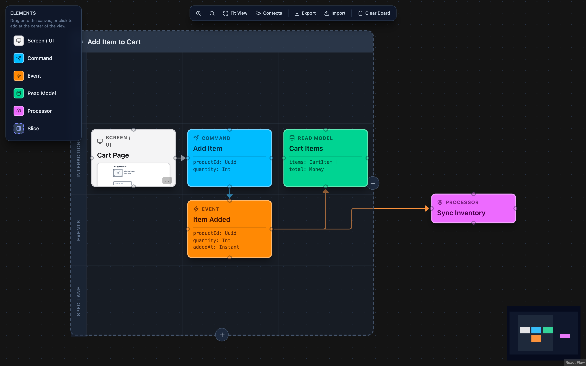
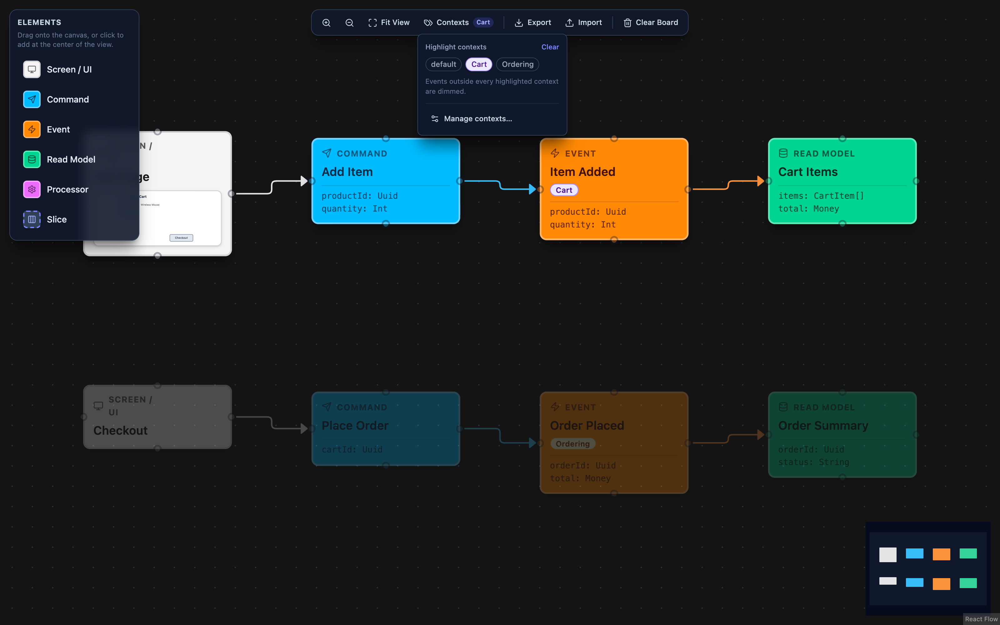
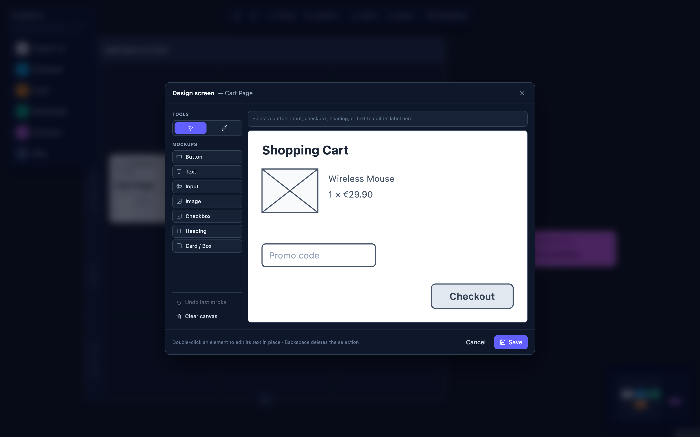
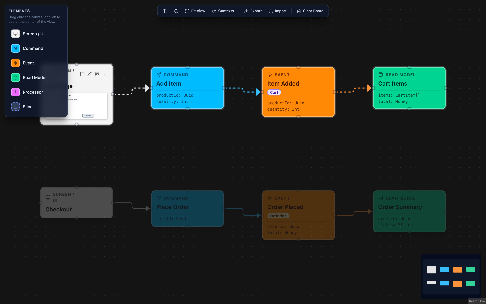

# Event Modeling Tool

Design event-driven systems the way they actually behave. **Event Modeller** is a
fast, friendly, **fully client-side** canvas for [Event Modeling](https://eventmodeling.org/).

### ▶︎ [Try it live](https://alex-w0.github.io/event-modeling/)



## Features

### DCB Context Management

Group your events into DCB (Dynamic Consistency Boundary) bounded contexts and keep
large models readable. Define contexts in the toolbar, assign events to one or more
of them, and they're tagged right on the card. From the **Contexts** dropdown you can
highlight one or several contexts — every event outside the highlighted set dims, so a
single flow stands out instantly.



### Screen wireframes

Mock up the actual UI behind each Screen node, not just a label. Open the wireframe editor: place mockup
primitives — button, input, image, checkbox, heading, text, card — or draw freehand
with the pencil tool. Saving
renders the wireframe right inside the node below its title.



### Play Data-Flow Button

Press play on any Screen, Command, Event or Processor to trace the data flow it sets
off. The node and everything downstream pulses, the connecting arrows animate in the
direction of flow, and the rest of the board spotlight-dims — so you can follow a
single slice end to end through a busy model. Only one trace runs at a time; press
stop (or play another node) to switch.



### Export / Import JSON structure

Your board autosaves to the browser, so a refresh never loses work. **Export** writes
the whole model to a single human-readable JSON file. **Import**
validates and restores it. 

## Run locally

```bash
npm install
npm run dev      # start dev server
npm run build    # type-check + production build
npm run preview  # serve the production build
```

## Structure

```
src/
  App.tsx                    providers + layout shell
  Board.tsx                  canvas, DnD drop logic, cell snapping/occupancy, import/export
  initialBoard.ts            starts empty — users build their own model from the palette
  types.ts                   element kinds, color schema, grid geometry constants
  nodes/
    CqrsNode.tsx             shared sticky-note card with 4-way handles + attributes block
    SliceNode.tsx            swimlane grid table with add-column/add-lane controls
  components/
    wireframe/               screen wireframe editor, node preview, shared SVG shapes
    Palette.tsx              floating drag-and-drop / click-to-add panel
    Toolbar.tsx              zoom, fit view, export/import, clear board
    ContextsManager.tsx      DCB context create / rename / delete dialog
    ContextsMenu.tsx         toolbar dropdown to highlight contexts
    FlowTraceContext.tsx     play/stop data-flow trace state
    DnDContext.tsx           shares the dragged palette kind during HTML5 DnD
  lib/
    grid.ts                  slice grid math (cells, occupancy, nearest free cell)
    persistence.ts           localStorage autosave/restore
    serialization.ts         JSON export download + validated import parsing
    id.ts                    readable collision-safe node ids
```
</content>
